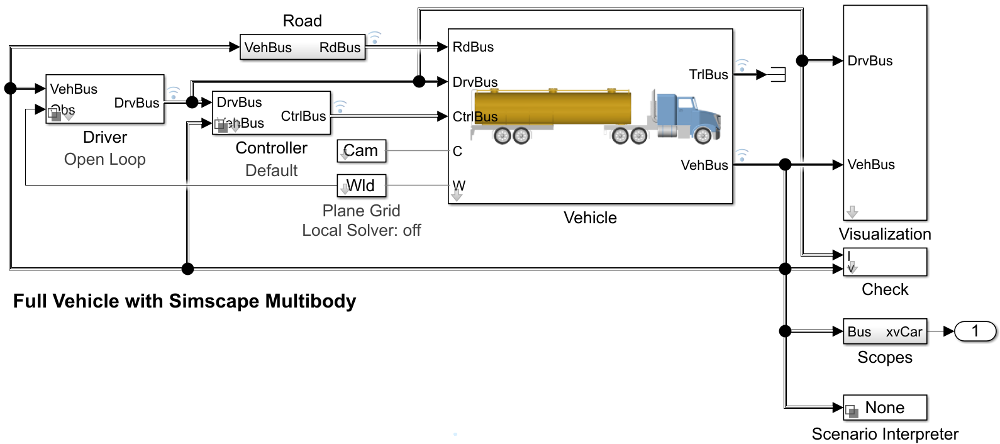
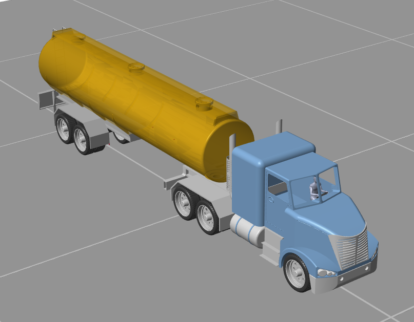

## Simscape Vehicle Template for Truck Model
This example implements a full vehicle model of a truck and trailer.
The model can be used to simulate the vheicle behavior, test different scenarios, perform closed and open-loop simulations etc. 

The main model is [sm_car_Axle3.slx](sm_car_Axle3.slx).

## Model description
The figure below shows the current model. The model can perform both open- and closed-loop simulations. 

 

The main subsystems of the model are: 
- Driver: Here the user can switch between an open-loop and a closed-loop driver
- Controller: Performs simple task such as power and torque control
- World: Creates the scene, positioning for example the road and the cones
- Camera: Stores and set the position of the different camera angles 
- Road: Sets the friction coefficient for the tires
- Scenario Interpreter: Optional if the user wants to load a certain Road Runner Scenario and add it to the simulation
- Vehicle: The plant model with the truck and the trailer model 

The figure below shows the type of truck implemented. The current model could theoretically be extended with a different truck model or a different trailer.

 

### Data structure
The data of the model is stored in several structures. A brief overview is given below: 
- Camera: Stores the position of the different cameras and views of the Simscape Multibody Mechanics Explorer
- Control: Stores the data used by the controller in the Control subsystem (e.g. controller gains)
- Driver: Stores the data used by the driver controller (only used for closed-loop simulation). 
- Init and Init_Trailer: Stores the initial position, orientation and speed of truck and trailer
- Vehicle and Trailer: Store the parameters of the components of truck and trailer
- Maneuver: Contains information of the maneuver to be performed. This information is required for example by the Driver subsystem (both for Open and Closed loop)
- Scene: Contains information on the dimension and orientation of the road. Is used by the Scene subsystem
- Visual: Only used to set some color and default appearance of the model

Please also note that the model has a set of callbacks as InitFcn, PreloadFcn and so on. These callbacks are also used to check for parameter integrity. 

## Simulate the model
Once you open the MATLAB project, the startup function startup_sm_car.m will set up all required variable and initialize the vehicle in a default configuration. 
The model can be simulated immediately. To run other scenarios, the function contained in the folder SetupFunctions show how to implement different scenario. Currently three main scenarios are implemented in the three script contained in SetupFunctions: 
- Wide Open Throttle test with braking (can be used with a plane surface or with a height variable surface) 
- Double lane change with plane surface
- Double lane change with RoadRunner scenario
To perform a WOT test for example, simply open and run the corresponding script as shown below:
 
## Installation
The model was developed in the 24b release and requires the following products:
- MATLAB
- Simulink
- Simscape
- Simscape Driveline
- Stateflow
- Simscape Multibody
- Automated Driving Toolbox
- Vehicle Dynamics Blockset

## Support
Lorenzo Nicoletti

## Authors and acknowledgment
Lorenzo Nicoletti: Developer

## License
No license needed. Not open source

## Sources
No sources